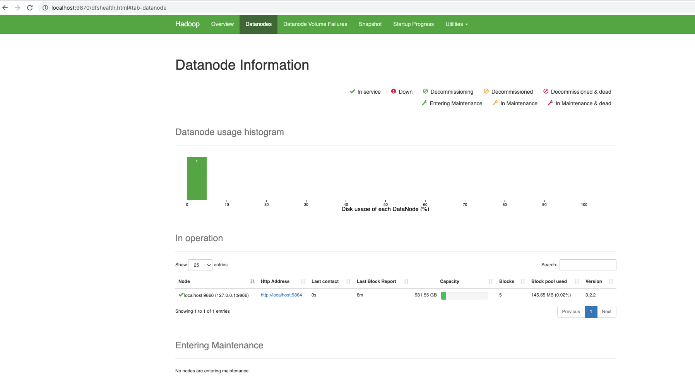
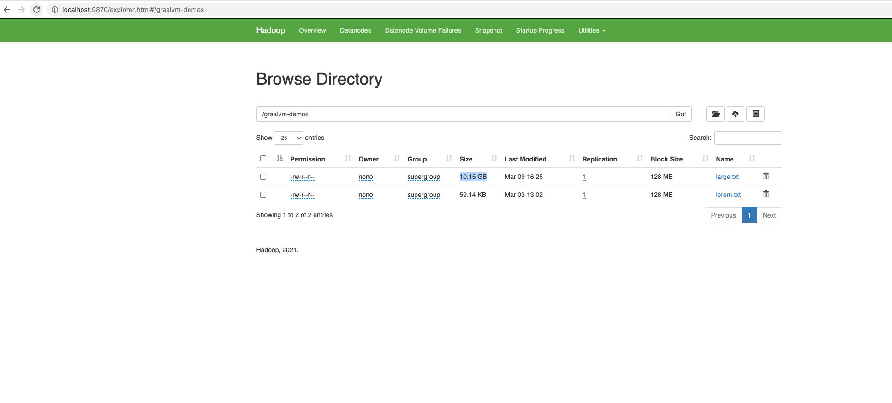
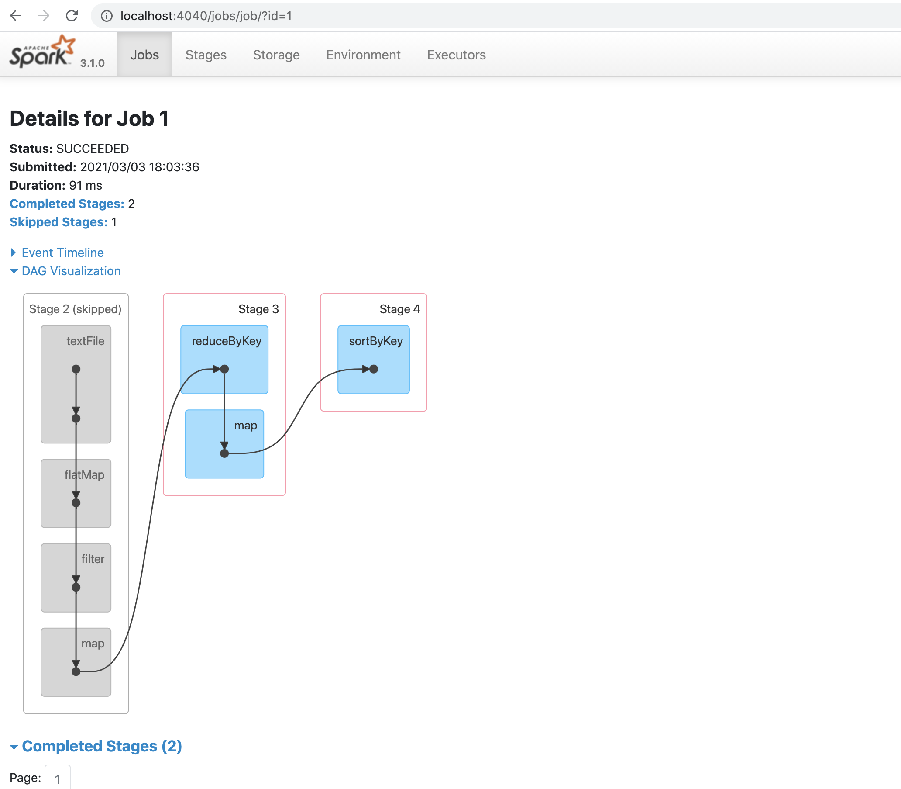

# Accelerating Apache Spark Big Data processes with GraalVM EE

## Introduction
In this tutorial, we will be using GraalVM EE to accelerate Big data processing.
The following sofware  are being used.
1. [Apache Hadoop 3.2.2 ( HDFS )](https://hadoop.apache.org/releases.html)
2. [Apache Spark 3.0.2 binairies for hadoop3.2](https://spark.apache.org/downloads.html)
3. [GraalVM EE 21.0](https://www.oracle.com/java/graalvm/)

## Installations 

### GraalVM 

### Hadoop  
Set up a single node Hadoop cluster.
We will not got into all the details of creating an apache Hadoop/ Spark cluser.
Follow the following videos from Joshua Hruzik to set up your Hadoop Cluster.
1. [Install Hadoop]( https://www.youtube.com/watch?v=VBd1je4Sv9Y)
2. [Configure Hadoop]( https://www.youtube.com/watch?v=EJj_0o-EY50)
3. [Interacting with HDFS](https://www.youtube.com/watch?v=QuAkwd_9q5w)


!

This tutorial should be straight forward.
For OSX users, you may encounter a *Warning* with Hadoop versions 3.0+
after starting ``dfs`` 

```
$HADOOP_HOME/sbin/start-all.sh
```

` WARN util.NativeCodeLoader: Unable to load native-hadoop library for your platform... using builtin-java classes where applicable`
This is not a blocker.
open your Hadoop console [http://localhost:9870](http://localhost:9870)


We will use only on the HDFS to store input files and rely on Apache Spark 
for the processing.

you can use Any S3 compliant object storage and adjust the file uri if you want.


### Dataset 
This tutorial shows a Spark job that handle that compute and retreive the Top Ten Words in a large File
For testing puprose we are creating a 10G file using the utility script 
```
$ make large.txt
$drwxr-xr-x  8 nono  staff   256B 10 mar 05:21 wordcount-spark-scala
-rw-r--r--  1 nono  staff   5,0K 10 mar 05:25 README.md
drwxr-xr-x  9 nono  staff   288B 10 mar 06:38 wordcount-spark-java
-rw-r--r--  1 nono  staff    59K 11 mar 12:55 lorem.txt
-rw-r--r--  1 nono  staff   178B 11 mar 13:00 Makefile
-rw-r--r--  1 nono  staff   173M 11 mar 13:03 temp.txt
-rw-r--r--  1 nono  staff    10G 11 mar 13:04 large.txt
``` 


After completing the tutorial, clean the file using 
```
$ make clean
```


In this section, we load the files we want to use for our benchmarks in HDFS.
First start your Hadoop Cluster

```
$HADOOP_HOME/sbin/start-all.sh
```
You have at least the hadoop Java processes
```
$ jps 

54294 NameNode
54726 ResourceManager
54824 NodeManager
54536 SecondaryNameNode
54396 DataNode
```


Put `lorem.txt`and  `large.txt` files in HDFS

```
$HADOOP_HOME/bin/hdfs dfs -mkdir /graalvm-demos
$HADOOP_HOME/bin/hdfs dfs -put lorem.txt /graalvm-demos/
$HADOOP_HOME/bin/hdfs dfs -put large.txt /graalvm-demos/

```
The files are uploaded and ready to use by Spark Jobs

```
$ $HADOOP_HOME/bin/hdfs dfs -ls /graalvm-demos
Found 2 items
-rw-r--r--   1 nono supergroup 10900620000 2021-03-09 16:25 /graalvm-demos/large.txt
-rw-r--r--   1 nono supergroup       60559 2021-03-03 13:02 /graalvm-demos/lorem.txt
```

You can also browse thses file from your Hadoop console 
Using the ` Utilities>Browse File System ` Menu 



### Spark

Install spark

Set the Hadoop configuration directory
```
export HADOOP_CONF_DIR=/Users/nono/Applications/BigData/hadoop-3.2.2/etc/hadoop
``` 


## GraalVM in action 
To be able to evaluate the application perf towards GraalVM,
We use a single executor and all the 6 cores available on our host


### Spark Java 

Let's build the application with maven
```
cd  wordcount 
mvn clean install 

INFO] ------------------------------------------------------------------------
[INFO] BUILD SUCCESS
[INFO] ------------------------------------------------------------------------
[INFO] Total time:  26.693 s
[INFO] Finished at: 2021-03-03T14:40:27+01:00
[INFO] ------------------------------------------------------------------------
```

#### with JRE 11

Change the spark configuration to rely on JRE 11
Change the `spark-env.sh` to enable Java 11 
```
export JAVA_HOME=/Library/Java/JavaVirtualMachines/jdk-11.0.9.jdk/Contents/Home
```


Then run a couple of tests with the following command

```
time ./spark-submit --master local[*]  --executor-cores 1 --total-executor-cores 2 --executor-memory 1G  --class com.oracle.demo.spark.WordCountJob  wordcount-spark-java/target/wordcount-spark-java-1.0-SNAPSHOT.jar
```

Results are computed and displyed like 
```
Running with Java : /Library/Java/JavaVirtualMachines/jdk-11.0.9.jdk/Contents/Home
(20340000,sit)
(20160000,sed)
(18000000,vel)
(16740000,eget)
(16380000,nec)
(16380000,amet)
(16200000,non)
(16020000,vitae)
(15300000,quis)
(13320000,Sed
```

Responses time are also printed 

Test1:
```
real	1m12.194s
user	11m9.937s
sys	0m11.625s
```

Test2: 
````
real	1m3.800s
user	9m43.405s
sys	0m11.096s
````

Test3: 
````
real	1m3.744s
user	10m3.252s
sys	0m10.494s
````

Now let's run the same command using GraalVM for Java 11


####  GraalVM21 for Java 11

Change the `spark-env.sh` to enable GraalVM

```
export JAVA_HOME=/Library/Java/JavaVirtualMachines/graalvm-ee-java11-21.0.0.2/Contents/Home
```

Submit the previously built job to Spark using 

```
time ./spark-submit --master local[*]  --executor-cores 1 --total-executor-cores 2 --executor-memory 1G  --class com.oracle.demo.spark.WordCountJob  wordcount-spark-java/target/wordcount-spark-java-1.0-SNAPSHOT.jar
```

Results are pretty simliar  
```
Running with Java : /Library/Java/JavaVirtualMachines/graalvm-ee-java11-21.0.0.2/Contents/Home
(20340000,sit)
(20160000,sed)
(18000000,vel)
(16740000,eget)
(16380000,nec)
(16380000,amet)
(16200000,non)
(16020000,vitae)
(15300000,quis)
(13320000,Sed
```

Responses time are also printed 

Test1:
```
real	0m55.095s
user	7m59.690s
sys	0m10.958s
```

Test2: 
````
real	0m53.551s
user	7m57.052s
sys	0m10.847s
````

Test3: 
````
real	0m55.448s
user	8m7.264s
sys	0m10.762s
````


The following metrics were captured for a small set of tests.
Numbers represents execution time with the selected java runtime  expressed in Seconds.

| Response Time in Seconds  |  |  |  |  |  |  |  |  |  |  |
|-|-|-|-|-|-|-|-|-|-|-|
| graalvm-ee-java11 | 55,10 | 53,55 | 55,45 | 52,05 | 56,73 | 53,65 | 53,12 | 51,11 | 55,65 | 56,94 |
| jdk-11 | 72,94 | 63,80 | 63,74 | 67,84 | 72,34 | 66,93 | 64,14 | 65,34 | 65,69 | 65,30 |


In average, for this use case the performance was improved by 	`18,07%`

In the Spark web console you can see the executed job




### Spark Scala 

In this section we build and benchmark the same Wordcount application in Scala.
switch to wordcount-spark-scala subfolder and use sbt to to package the JAR 

````
$cd wordcount-spark-scala 
$sbt package 
[success] Total time: 16 s, completed 15 mars 2021 à 16:20:56
````


```
$ $ time ./spark-submit --master local[*]  --executor-cores 1 --total-executor-cores 2 --executor-memory 1G  --class --class com.oracle.demo.spark.Main  wordcount-spark-scala/target/scala-2.12/wordcount-scala_2.12-0.1.jar
```


Running with Java:/Library/Java/JavaVirtualMachines/jdk-11.0.9.jdk/Contents/Home
(20340000,sit)
(20160000,sed)
(18000000,vel)
(16740000,eget)
(16380000,nec)
(16380000,amet)
(16200000,non)
(16020000,vitae)
(15300000,quis)
(13320000,Sed)
2021-03-15 16:31:34,092 INFO server.AbstractConnector: Stopped Spark@71f0b72e{HTTP/1.1, (http/1.1)}{0.0.0.0:4040}

real	1m13.340s
user	10m24.013s
sys	0m11.013s

In the same way, we can collect some metrics while running with both Runtimes

| Response Time in Seconds  |  |  |  |  |  |  |  |  |  |  |
|-|-|-|-|-|-|-|-|-|-|-|
| graalvm-ee-java11 | 53,06|	52,31|	51,60|	50,32|	53,76|	53,37|	50,67|	52,70|	52,28|	49,66|	51,973|
| jdk-11 | 73,34|	68,69|	63,60|	67,29|	61,36|	67,70|	70,60|	70,54|	62,47|	61,83 |


In average, for this use case the performance was improved by 	`22,13%` with Scala.


### Polyglot Spark Java->PySpark


## More reading
- [Apache Spark—Lightning fast on GraalVM Enterprise](https://blogs.oracle.com/graalvm/apache-spark%e2%80%94lightning-fast-on-graalvm-enterprise)