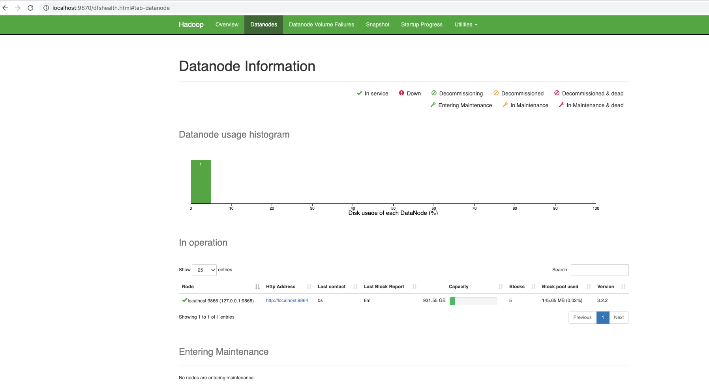
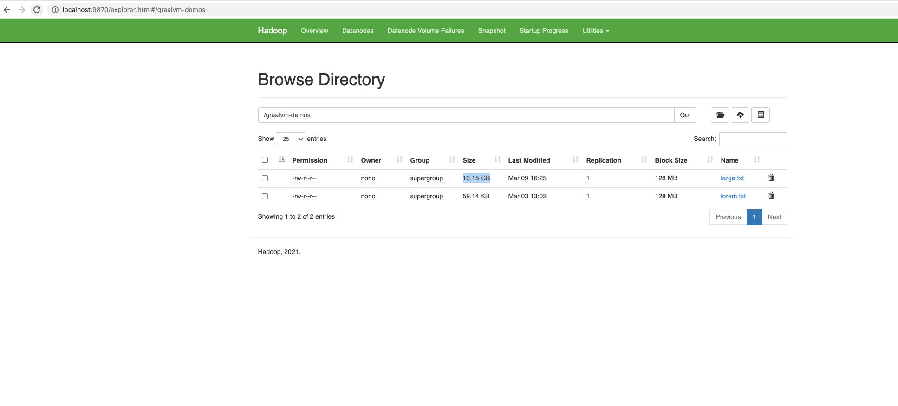
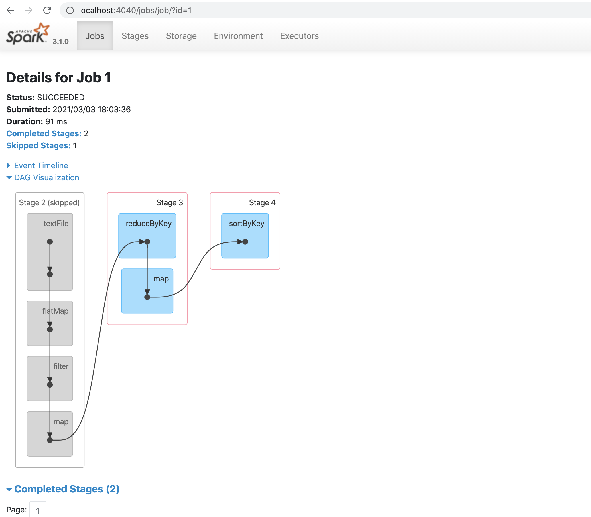

# Accelerating Apache Spark Big Data processes with GraalVM EE

## Introduction
In this tutorial, we will be using GraalVM EE to accelerate Big data processing.
The following sofware  are being used.
1. [Apache Hadoop 3.2.2 ( HDFS )](https://hadoop.apache.org/releases.html)
2. [Apache Spark 3.0.2 binairies for hadoop3.2](https://spark.apache.org/downloads.html)
3. [GraalVM EE 21.0](https://www.oracle.com/java/graalvm/)

## Installations 

### GraalVM 

### Hadoop  
Set up a single node Hadoop cluster.
We will not got into all the details of creating an apache Hadoop/ Spark cluser.
Follow the following videos from Joshua Hruzik to set up your Hadoop Cluster.
1. [Install Hadoop]( https://www.youtube.com/watch?v=VBd1je4Sv9Y)
2. [Configure Hadoop]( https://www.youtube.com/watch?v=EJj_0o-EY50)
3. [Interacting with HDFS](https://www.youtube.com/watch?v=QuAkwd_9q5w)


!

This tutorial should be straight forward.
For OSX users, you may encounter a *Warning* with Hadoop versions 3.0+
after starting ``dfs`` 

```
$HADOOP_HOME/sbin/start-all.sh
```

` WARN util.NativeCodeLoader: Unable to load native-hadoop library for your platform... using builtin-java classes where applicable`
This is not a blocker.
open your Hadoop console [http://localhost:9870](http://localhost:9870)


We will use only on the HDFS to store input files and rely on Apache Spark 
for the processing.

you can use Any S3 compliant object storage and adjust the file uri if you want.


### Dataset 
In this section, we load the files we want to use for our benchmarks in HDFS.
First start your Hadoop Cluster

```
$HADOOP_HOME/sbin/start-all.sh
```
You have at least the hadoop Java processes
```
$ jps 

54294 NameNode
54726 ResourceManager
54824 NodeManager
54536 SecondaryNameNode
54396 DataNode
```


Put `lorem.txt`and  `large.txt` files in HDFS

```
$HADOOP_HOME/bin/hdfs dfs -mkdir /graalvm-demos
$HADOOP_HOME/bin/hdfs dfs -put src/main/resources/large.txt /graalvm-demos/
$HADOOP_HOME/bin/hdfs dfs -put src/main/resources/large.txt /graalvm-demos/

```
The files are uploaded and ready to use by Spark Jobs

```
$ $HADOOP_HOME/bin/hdfs dfs -ls /graalvm-demos
Found 2 items
-rw-r--r--   1 nono supergroup  151397500 2021-03-03 13:01 /graalvm-demos/large.txt
-rw-r--r--   1 nono supergroup      60559 2021-03-03 13:02 /graalvm-demos/lorem.txt
```

You can also browse thses file from your Hadoop console 
Using the ` Utilities>Browse File System ` Menu 



### Spark

Install spark

Set the Hadoop configuration directory
```
export HADOOP_CONF_DIR=/Users/nono/Applications/BigData/hadoop-3.2.2/etc/hadoop
``` 


## GraalVM in action 
To be able to evaluate the application perf towards GraalVM,
We use a single executor and all the 6 cores available on our host


### Spark Java 

Let's build the application with maven
```
cd  wordcount 
mvn clean install 

INFO] ------------------------------------------------------------------------
[INFO] BUILD SUCCESS
[INFO] ------------------------------------------------------------------------
[INFO] Total time:  26.693 s
[INFO] Finished at: 2021-03-03T14:40:27+01:00
[INFO] ------------------------------------------------------------------------
```

#### with JRE 11

Change the spark configuration to rely on JRE 11
Change the `spark-env.sh` to enable Java 11 
```
export JAVA_HOME=/Library/Java/JavaVirtualMachines/jdk-11.0.9.jdk/Contents/Home
```
####  GraalVM21 for Java 11

Change the `spark-env.sh` to enable GraalVM

```
export JAVA_HOME=/Library/Java/JavaVirtualMachines/graalvm-ee-java11-21.0.0.2/Contents/Home
```

Submit the previously built job to Spark using 
```bash
spark-submit   --class com.oracle.demo.spark.WordCountJob  target/wordcount-spark-java-1.0-SNAPSHOT.jar
...
Running with Java : /Library/Java/JavaVirtualMachines/graalvm-ee-java11-21.0.0.2/Contents/Home
(282500,sit)
(280000,sed)
(250000,vel)
(232500,eget)
(227500,nec)
(227500,amet)
(225000,non)
(222500,vitae)
(212500,quis)
(185000,Sed)
```
In the Spark web console you can see the executed job



Now we are going to capture metrics
Test1: 
``` 
$ time ./spark-submit   --class com.oracle.demo.spark.WordCountJob  target/wordcount-spark-java-1.0-SNAPSHOT.jar
: /Library/Java/JavaVirtualMachines/graalvm-ee-java11-21.0.0.2/Contents/Home
(282500,sit)
(280000,sed)
(250000,vel)
(232500,eget)
(227500,nec)
(227500,amet)
(225000,non)
(222500,vitae)
(212500,quis)
(185000,Sed)
2021-03-03 18:25:25,373 INFO server.AbstractConnector: Stopped Spark@62b969c4{HTTP/1.1, (http/1.1)}{0.0.0.0:4040}

real	0m6.637s
user	0m15.349s
sys	0m0.967s
```

Test2:
```
$ time ./spark-submit   --class com.oracle.demo.spark.WordCountJob  target/wordcount-spark-java-1.0-SNAPSHOT.jar

real	0m6.831s
user	0m16.328s
sys	0m0.977s
```

### Spark Scala 


### Polyglot Spark Java->PySpark


## More reading
- [Apache Spark—Lightning fast on GraalVM Enterprise](https://blogs.oracle.com/graalvm/apache-spark%e2%80%94lightning-fast-on-graalvm-enterprise)